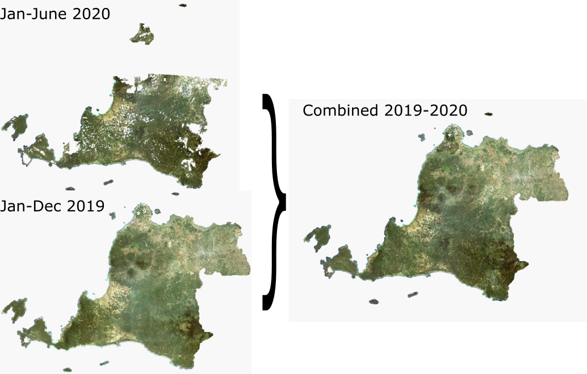
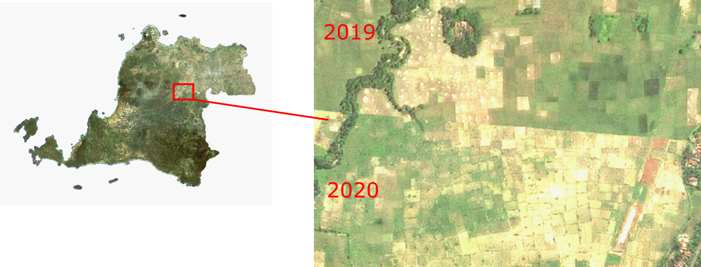

## Preparing Satellite Imagery

In this section, we will focus on preparing SPOT 6/7 data to become ready-to-used data for segmentation.  The preparing process consist of 3 steps: 
merging data from several periods, warp/slice imagery for each grid (10 km x 10 km), and patching imagery for boundary area


### 1. Merge SPOT 6/7 
The SPOT data that we acquired from BRIN-LAPAN are split into each province. Basically, every province have 2 images (1 image composite of Jan-Dec 2019 and 1 image composite of Jan-Jun 2020). But there are several provinces that limited on one time period (either 2019-composite or 2020-composite).
We will utilize those two periods to fill the coverage gap, if there are two periods composite imagery.

The image below will explain the main idea of first step.


As expected, after merging two images, there will be visible contrast of two images. 


Despite that, the contrary is acceptable to fill the gap of coverages from recent acquisition with penultimate ones. 

To perform this step, we use this code.
```commandline
#input path
ds_2019=r'path/to/images2019.ecw'
ds_2020=r'path/to/images2020.ecw'

#output path
path_D='path/to/ouput.vrt'

#syntax
from osgeo import gdal
ds=gdal.BuildVRT(path_D,[ds_2019,ds_2020])
ds=None
```
The output of this code will be VRT file. VRT file is preferable due to the advantages in small file size. It can be achieved because the file store the data virtually compared physically. In contrary, this file is used for non-complicated further operation. More information about this extension referred to this <a href='https://gdal.org/drivers/raster/vrt.html'>link</a>.

### 2. Warp Images
After building the merged file we clip the result into small grid 10km-10km for each province (this step is used ```gdal_warp``` function). We use this approach to enlighten the workloads of next procedure (Segmentation process). The grid file are prepared independently aside this procedure. Furthermore, the grid is also used in Machine Learning project conducted in the 2021.

The images below will describe the process.


To perform this step, this code will be used. In addition, this code also run in the Python Console inside QGIS.
```commandline
from qgis.core import *
import qgis.utils
from qgis.core import QgsVectorLayer
import os
os.chdir('D:')
path_D=r'path/to/ouput.vrt'
from osgeo import gdal

#The main code for clipping/warp
def clip_spot(crop_,name_,prov):
    ds=gdal.Warp('patched_'+name_+'.tif',path_D,
            outputBounds=crop_,warpOptions='CUTLINE_ALL_TOUCHED=TRUE')
    ds=None

#The grid provinces
data=QgsVectorLayer('path/to/grid_prov.gpkg','data_rep','ogr')
features_data=data.getFeatures()

#Iterative function
for i in features_data:
    bottom_=i['bottom']
    top_=i['top']
    left_=i['left']
    right_=i['right']
    nama_=i['ID_GRID']
    cropbound=[left_,bottom_,right_,top_]
    clip_spot(cropbound,nama_,'ID_PROV')
    print(i)
```
The output of this code is tif file with size 10km-10km represent the grid. If the SPOT file have 1000 grid, the result of this code would be also 1000 tif file.

### 3. Patched Imagery in Boundary Area

After clipping/warp image into 10km-10km size, we will continue patch the tif image, which located in boundary of province. For example, grid with ID-0024 is found in Aceh and North Sumatera, the result of previous step would two image with same grid. Therefore, we need to patch those tiff into one file for making the next procedure easier.

The image below can be used to describe the process.


To perform this step, we will use this code inside the Python Console in QGIS.
```commandline
from osgeo import gdal
import os
import shutil
from glob import glob

#To get the list of grid tif file
data_tif=glob('D:\*.tif')
id_split-set([i[11:] for i in data_tif])

for i in id_split:
    data_splitted=[j for j in data_tif if j[11:]==i]
    if len(data_splitted)>1:
        vrt=i.replace('tif','vrt')
        gdal.buildVRT(vrt,sorted(data_splitted,reverse=False))
        gdal.Translate('patched_'+i,vrt)
    else:
        shutil(data_splitted[0],'patched_'+i)
```