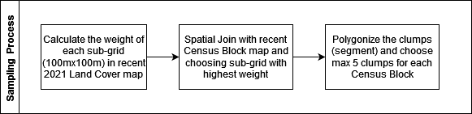

## Choosing Clumps/Segment as Sample Locations

After acquiring clumps (sometimes called segment/cluster), the next process is deciding the clumps area that will be used as sample. Due to the limitation of workload and budgets, several clumps/segment will be selected.

In this procedure, several steps will be conducted as shown in image below,

### Calculate the weight of each sub-grid

In this step, each grid will be divided into sub-grid, which has size about 100m x 100m. Next, we will calculate the weight of every sub-grid. 
The calculation of weight are using the Agricultural Land Cover produced in 2021 by Statistics Indonesia-BPS.

Here is several factor that we used for calculating the weight:

1. Shannon Index, this index will be used to measure the diversity of agricultural class. 

    The Shannon index formula:

    
2. Percentage of agricultural fields in 100mx100m, the agricultural fields are consist of paddy field, dry-farm land, and plantation.
3. Major Agricultural Class, in this calculation the dry-farm land and plantation class is preferred compared the paddy field. 

Below is the code of the