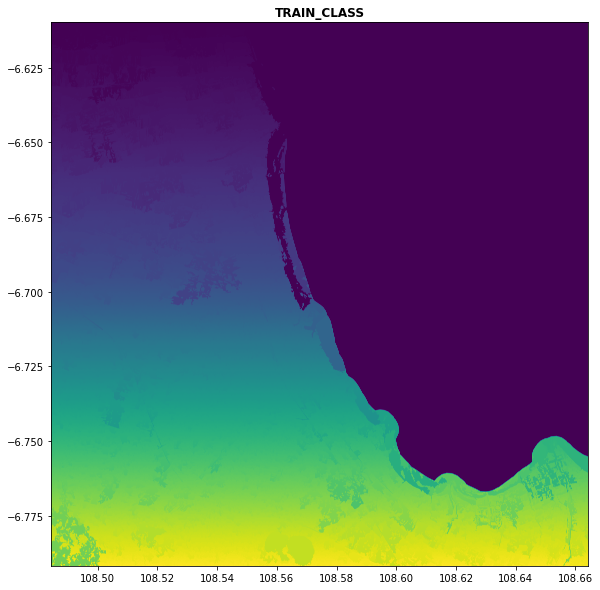

## Segmentation Data from Satellite Imagery

Segmentation is process of partitioning raster into some non-overlapping partitions, called segments. 
Input of segmentation is patched raster we get from previous step. One of input raster is showed below:

```commandline
import matplotlib.pyplot as plt
import rasterio
from rasterio.plot import show

inImage='input/32_Jabar_2020_ID-1897.tif'
outputClumps='output clumps/ID-1897_notile_1000px_processInMem_specBand.tif'

rds = rasterio.open(inImage)
fig, ax = plt.subplots(1,1, figsize=(10,10))
show(rds, ax=ax, title = "TRAIN_CLASS")
plt.show()
```


We use ```segutils.runShepherdSegmentation``` function on ```rsgislib``` library. 
This segmentation method has four steps:

1. A seeding step: identifies the unique spectral signatures within the image, 
2. A clumping process : to create unique regions, 
3. An elimination process : to remove regions below the minimum mapping unit, and, 
4. Relabelled the image

More information about this segmentation step and  function we used can be found at this <a href='http://rsgislib.org/rsgislib_segmentation.html'>link</a>.   
We set the initial number of cluster centres to 6 clusters and the minimum pixel of each clumps to 500 pixels.
To perform this segmentation step, this code will be used.

```commandline
from rsgislib.segmentation import segutils

segutils.runShepherdSegmentation(inImage,
                                 outputClumps,
                                 numClusters=6,
                                 minPxls=500,
                                 bands=[1,2,3],
                                 gdalformat='GTiff',
                                 kmMaxIter=5,
                                 distThres=500,
                                 noStats=True,
                                 noStretch=True,
                                 processInMem=True)
```

Output of segmentation process is raster image [TIFF format] based on gdalformat parameter we set. 
This is the segmented raster image we produced: 

```commandline
rds = rasterio.open(outputClumps)
fig, ax = plt.subplots(1,1, figsize=(10,10))
show(rds, ax=ax, title = "TRAIN_CLASS")
plt.show()
```

